# To-Do App 

## Overview 
This simple To-Do project uses the MERN stack and React bootstrap. Deployed with Heroku for easy viewing and use of application.

  ## Table of Contents:
  - [Links to Deployed app](#Links (*deployed app and repo*))
  - [Screenshots and Vids](#Screenshots_and_Vids)
  - [Motivation](#Motivation)
  - [Installation](#Installation)
  - [How to use](#How_to_use)
  - [Benefit](#Benefit)
  - [Future Add Ons](#Future_Add_Ons)
  - [License](#License)
  - [Tests](#Tests)
  - [Contribute](#Contribute)
  - [Additional Screenshots](#Additional_Screenshots)

 ## Links (*deployed app and repo*)
  - [Heroku](https://todo-app-with-mern.herokuapp.com/)
  - [GitHub Repo](https://github.com/jmeggles/To-Do-App)

 ## Screenshots_and_Vids 
  - 
  - 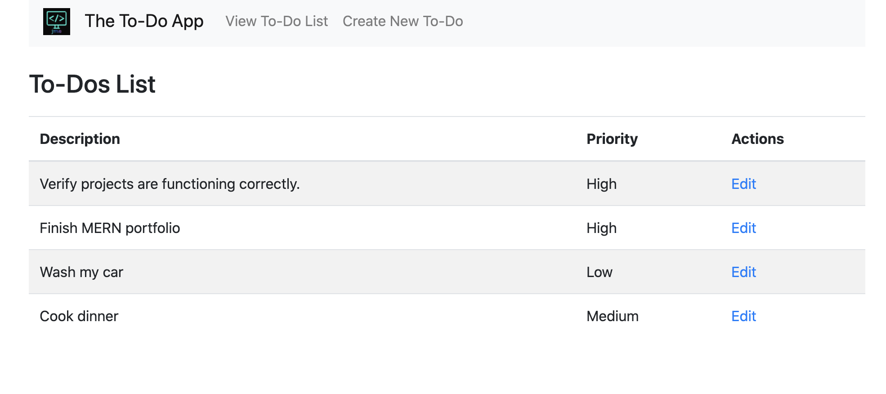  
  - 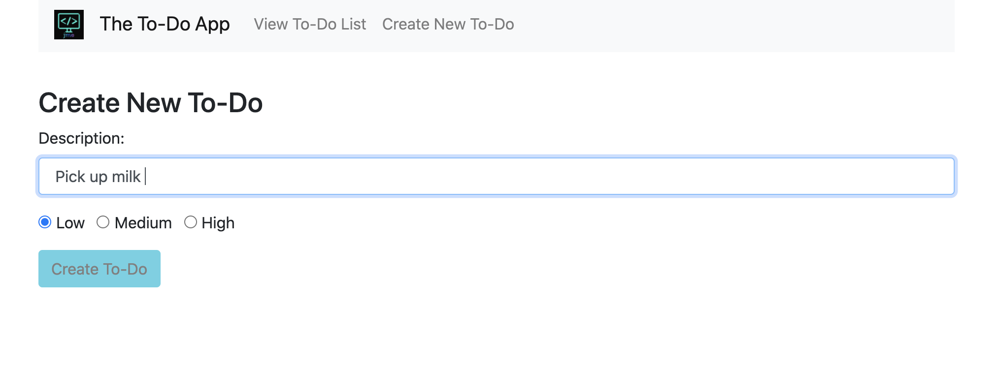
  - 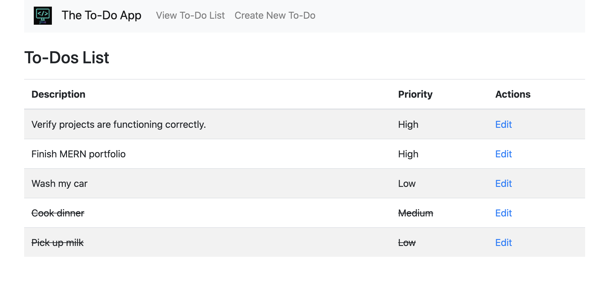  
  - 
  
  ## Motivation
 Intriqued by the many ways to approach building a React app, I am researching and actively building as many projects as I can to keep learning.  This is one of many and will be updating as I learn more.

  ## Installation  
No install necessary to view/use the app. Follow this [link](https://todo-app-with-mern.herokuapp.com/).  However, to install, clone repo and `npm i` which will concurrently add the `node_modules` to both the frontend and the backend.  Then `npm start` to run application locally.  Uses port 3001. 

  ## How_to_use
After install or following this [link](https://todo-app-with-mern.herokuapp.com/), the page will load with the current to-dos.  Click on *Create New To-Do* to start a new task.  To view all to-dos, click on *View To-Do List*. To complete a task, from the *View To-Do List* page, click *Edit* and simply write over the task with a new one or lick the *Completed* box to keep that task in view.  

  ## Benefit
 The app helps keep responsibilites in order.  Anyone can utilize this app for school, work, or home activities. 

 ## Future_Add_Ons
 I will add a sorting option and physical delete buttons in future updates. As I use the app more, I will add additional updates.

  ## Tests
Postman was successffully used to ensure the database was receiving all *Get*, *Post*, and *Update* requests. Travis CI also used to verify build success.
 
  ## License 
  
  [MIT License](https://opensource.org/licenses/MIT)
  
  Copyright © 2020 Jody Eggleston 

  ## Contribute
  For comments, questions and/or to contribute to projects, contact Jody Eggleston via 
  [Linkedin](https://www.linkedin.com/in/jody-eggleston/)

  ## Additional_Screenshots
  - 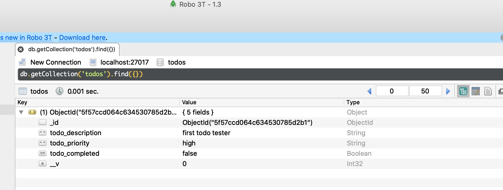
  - 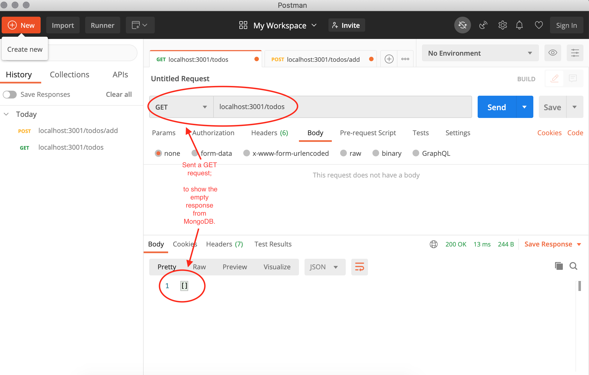
  - 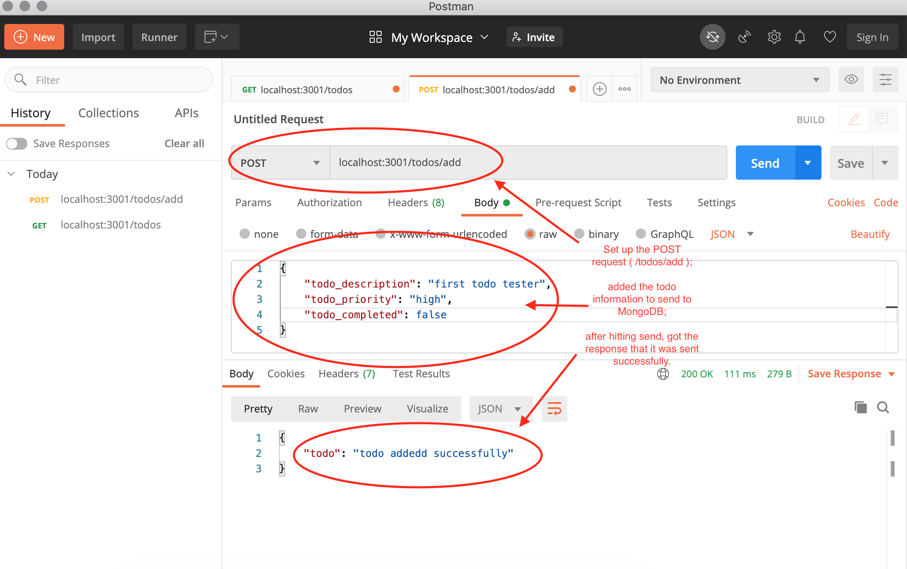
  - 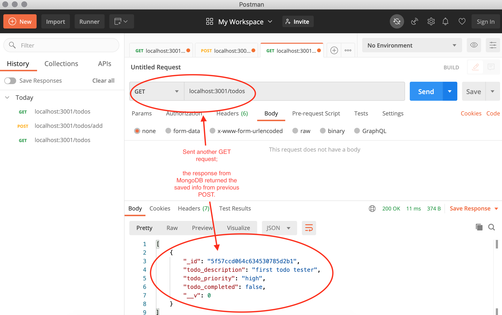
  - 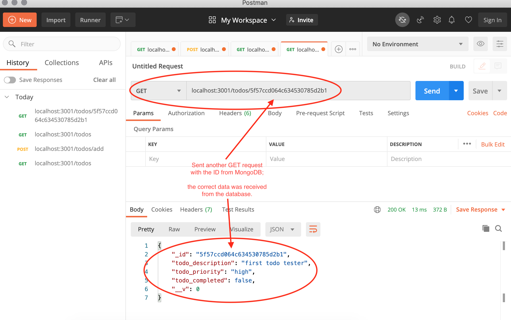
  - 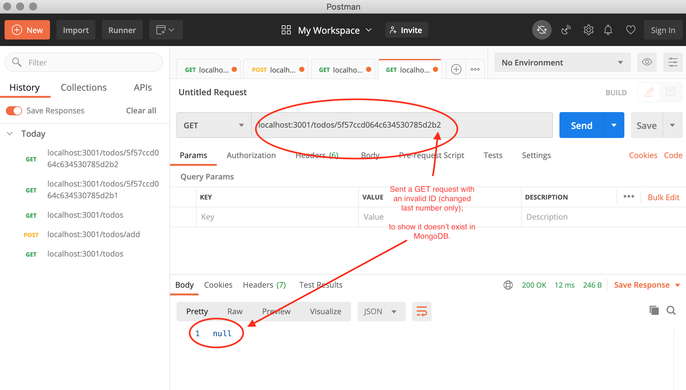
  - 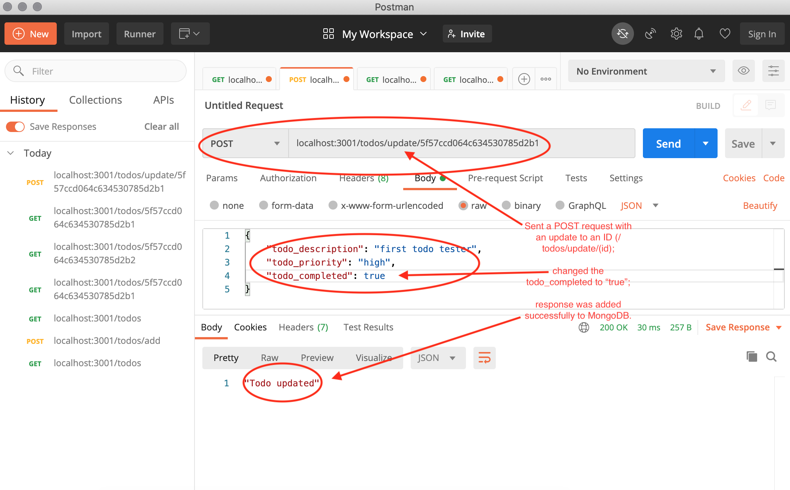
  - 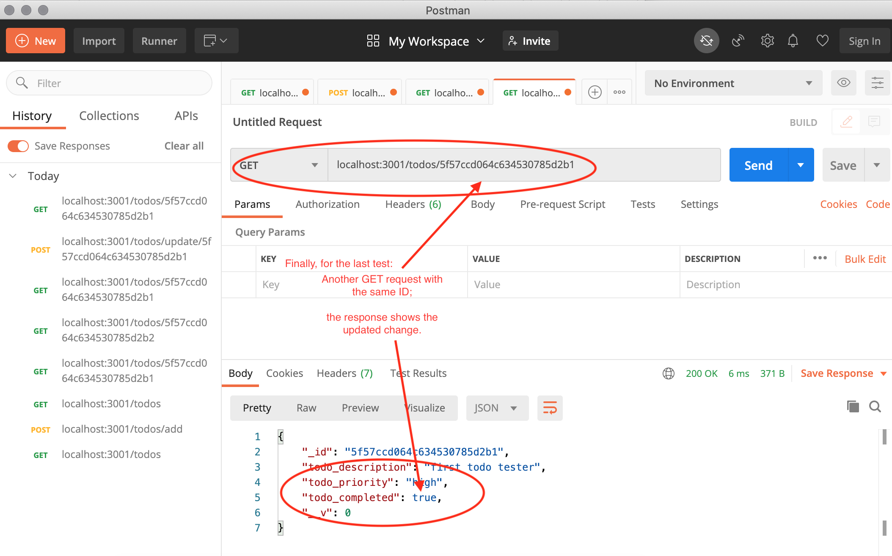
